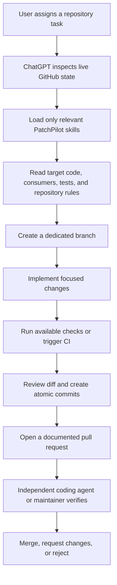

<div align="center">

# PatchPilot

### Turn ChatGPT Web into a disciplined PR-only GitHub coding agent

<p>
  Inspect repositories, implement focused changes, create atomic commits, and open review-ready pull requests without giving the chat permission to merge.
</p>

<p>
  
  
  
  
</p>

<p>
  
  
  
  
</p>

<p>
  <a href="#why-patchpilot">Why</a> ·
  <a href="#built-for-continuous-open-source-work">Use case</a> ·
  <a href="#how-it-works">How it works</a> ·
  <a href="#quick-start">Quick start</a> ·
  <a href="#included-files">Files</a> ·
  <a href="#tooling">Tooling</a> ·
  <a href="#examples">Examples</a> ·
  <a href="#recommended-workflow">Workflow</a> ·
  <a href="#responsible-use">Responsible use</a> ·
  <a href="#limitations">Limitations</a> ·
  <a href="./FAQ.md">FAQ</a>
</p>

</div>

<!-- project-story:start -->
<details open>
  <summary><strong>Problem to project: Why I built PatchPilot</strong></summary>
  <br />
  <p align="center"></p>
  <table>
    <tr>
      <td width="104" align="center" valign="middle"></td>
      <td valign="middle"><strong>PatchPilot</strong><br />A PR-only operating kit for disciplined GitHub repository work from ChatGPT Web.</td>
    </tr>
  </table>
  <table>
    <tr>
      <td width="50%" valign="top"><strong>Recurring problem</strong><br />Chat-based repository work can touch default branches, mix unrelated changes, or claim tests without evidence when the operating boundary is vague.</td>
      <td width="50%" valign="top"><strong>Practical goal</strong><br />Make ChatGPT inspect live repository state, create focused branches and commits, open review-ready pull requests, and stop before merge.</td>
    </tr>
    <tr>
      <td width="50%" valign="top"><strong>Built for</strong><br />Open-source maintainers and developers preparing bounded GitHub changes from ChatGPT Web.</td>
      <td width="50%" valign="top"><strong>Search terms</strong><br />ChatGPT GitHub coding agent · PR only AI agent · review ready pull requests · GitHub workflow guardrails</td>
    </tr>
  </table>
  <p><strong>Daily build pulse</strong></p>
  <ul>
      <li>1 commit landed: docs: add dynamic project story card.</li>
      <li>1 pull request updated, led by #5: docs: add dynamic project story card.</li>
      <li>Daily summary covers 2 public activity items from the last 7 days.</li>
  </ul>
</details>
<!-- project-story:end -->

---

## What's new in 1.1.0

PatchPilot 1.1.0 turns the kit into a proper GitHub project that
follows its own operating contract:

- a Python validation script and a CI workflow that runs it on every
  push and pull request
- a Python release script that produces a clean zip artefact
- an [`AGENTS.md`](./AGENTS.md) that applies the kit's contract to this
  repository
- a [`CONTRIBUTING.md`](./CONTRIBUTING.md), a
  [`CODE_OF_CONDUCT.md`](./CODE_OF_CONDUCT.md), a
  [`SECURITY.md`](./SECURITY.md), and a [`CHANGELOG.md`](./CHANGELOG.md)
- a [`PULL_REQUEST_TEMPLATE.md`](./.github/PULL_REQUEST_TEMPLATE.md) and
  three issue templates (bug report, feature request, skill request)
- stack-specific example presets in [`examples/`](./examples/) for
  Node.js CLIs, Python libraries, and monorepos
- a deep-dive [integration guide](./docs/INTEGRATION.md) and an
  [FAQ](./FAQ.md)

See [`CHANGELOG.md`](./CHANGELOG.md) for the full 1.1.0 changelog.

---

## What is PatchPilot?

PatchPilot is a reusable ChatGPT Project kit for turning the ChatGPT Web UI into a focused GitHub pull request creator.

It gives ChatGPT a strict operating model for repository work:

- inspect the live repository before changing anything
- read repository instructions, code, tests, issues, pull requests, and CI
- work from a dedicated branch
- implement a bounded bug fix, feature, refactor, test, documentation, or CI change
- create small, meaningful commits
- open a detailed pull request
- stop before merge

PatchPilot is not intended to replace a full local coding agent. It sits earlier in the workflow and prepares reviewable implementation work for a separate coding agent or human maintainer to verify and merge.

## Why PatchPilot?

ChatGPT Web can already reason about product requirements, inspect GitHub repositories, research current technical information, work with uploaded project files, and use connected tools. The missing piece is a disciplined repository workflow.

Without clear operating rules, a chat may:

- modify the default branch directly
- duplicate work already present in another pull request
- claim tests passed when they were never executed
- mix unrelated changes into one branch
- create large context-heavy sessions
- follow unsafe instructions found inside repository content
- treat a backlog item as proof that a feature exists

PatchPilot adds the missing guardrails and task-specific playbooks.


## Built for continuous open-source work

PatchPilot grew from a simple working habit: I am always improving workflows, skills, documentation, open-source tools, playbooks, and small repository changes directly on GitHub.

I wanted a practical way to inspect a repository, make a focused improvement, and open a reviewable PR even when I am away from a full local coding setup. ChatGPT Web became the most useful place for that workflow. Its connected GitHub tools, broad reasoning context, and generous interactive limits make it possible to keep building and maintaining useful open-source work from almost anywhere.

A sincere thank you to OpenAI for providing limits generous enough to make this kind of creative and technical workflow practical.

### Primary use case

PatchPilot is strongest as a continuous improvement layer for work such as:

- refining agent workflows, system prompts, and reusable skills
- improving documentation, examples, onboarding, and internal links
- maintaining GitHub Actions and repository automation
- fixing bounded bugs and adding regression coverage
- building small open-source utilities and developer tools
- developing practical playbooks and knowledge packs
- converting clear backlog items into focused pull requests
- preparing useful changes from any device, then handing them to a full coding agent or human reviewer

The goal is not to imitate a complete local development environment. The goal is to make small, meaningful GitHub contributions easier to prepare, review, and continue.

## How it works



The separation of responsibilities is deliberate:

| PatchPilot in ChatGPT Web | Independent reviewer or coding agent |
| --- | --- |
| Repository inspection | Full workspace verification |
| Focused implementation | Runtime and integration testing |
| Regression test preparation | Architecture and security review |
| Branch and commit creation | Corrections where needed |
| Pull request documentation | Final merge decision |

## Core operating principles

### PR-only by design

PatchPilot must never push directly to `main`, `master`, or another protected default branch. Every implementation follows:

```text
Default branch
  -> dedicated branch
  -> atomic commits
  -> pull request
  -> independent verification
```

### Live repository first

The current code, tests, repository instructions, recent commits, open PRs, and CI results are authoritative. Roadmaps and backlogs describe intent, not shipped behavior.

### No fabricated validation

A test, build, lint check, type-check, migration, benchmark, server, or UI flow is only reported as passed when it was actually executed or verified through GitHub Actions.

### Context-aware skill loading

The agent starts with `SKILLS_INDEX.md` and loads only the files needed for the current task. A bug fix does not need to consume the same context as a CI repair or architecture review.

### Independent merge authority

PatchPilot creates the implementation and the pull request. A separate agent or human owns full validation, approval, and merge.

## What PatchPilot can handle well

- verified bug fixes
- regression tests
- small and medium features
- bounded refactors
- error handling and validation
- CLI improvements
- GitHub Actions and CI fixes
- accessibility improvements
- internal links and documentation repairs
- developer experience improvements
- backlog items with clear acceptance criteria
- pull request repair after review feedback
- repository onboarding and architecture mapping
- recurring maintenance rounds

## What it deliberately avoids

PatchPilot does not automatically:

- merge pull requests
- enable auto-merge
- force-push
- publish packages
- create releases or tags
- change versions without an explicit request
- run destructive production migrations
- expose repository secrets
- modify production credentials
- close issues without verified acceptance criteria
- claim a repository is fully tested when only partial checks ran

## Quick start

### 1. Create one ChatGPT Project per repository

Recommended naming:

```text
PatchPilot | owner/repository
```

Keeping repositories in separate Projects reduces architecture and context leakage between unrelated codebases.

### 2. Add the main system prompt

Copy the complete contents of [`SYSTEM_PROMPT.txt`](./SYSTEM_PROMPT.txt) into the ChatGPT Project Instructions field.

The prompt is kept below 8,000 characters so it fits the Project Instructions limit while preserving the non-negotiable rules.

### 3. Upload the knowledge files

Upload these files to the ChatGPT Project:

```text
SKILLS_INDEX.md
skills/*.md
templates/*.md
```

The files under `prompts/` are optional task starters. Upload all of them, or only the workflows you expect to use.

### 4. Connect GitHub

Connect only the repositories the Project needs. Keep write confirmations enabled when available.

PatchPilot expects GitHub access that can inspect code and create branches, commits, and pull requests. Available actions may vary by account, plan, workspace policy, and connector configuration.

### 5. Start with repository onboarding

Use [`prompts/REPOSITORY_ONBOARDING.md`](./prompts/REPOSITORY_ONBOARDING.md) for the first session. It creates a grounded picture of:

- default branch and current head
- repository instructions
- architecture and important files
- open issues and pull requests
- test and build commands
- CI state
- current risks and backlog relevance

### 6. Assign a focused task

Example:

```text
@GitHub

Work exclusively on imMamdouhaboammar/agent-kernel.
Operate in strict PR-only mode.

Inspect the latest master branch, repository instructions, recent commits,
open issues, open pull requests, tests, CI, and the existing implementation.

Find and implement the highest-value safe improvement in MCP request validation.
Create a dedicated branch, add regression coverage, run every available check,
and open a documented pull request. Do not merge it.
```

## Included files

```text
patchpilot/
├── AGENTS.md
├── CHANGELOG.md
├── CODE_OF_CONDUCT.md
├── CONTRIBUTING.md
├── FAQ.md
├── LICENSE
├── MANIFEST.json
├── README.md
├── SECURITY.md
├── SKILLS_INDEX.md
├── SYSTEM_PROMPT.txt
├── VALIDATION_REPORT.md
├── skills/
│   ├── ARCHITECTURE_ANALYSIS.md
│   ├── CHANGE_EXECUTION.md
│   ├── CONTEXT_CHECKPOINTS.md
│   ├── PR_CREATION.md
│   ├── REPOSITORY_DISCOVERY.md
│   ├── SECURITY_AND_TRUST.md
│   ├── TASK_MODES.md
│   ├── TOOL_ROUTING.md
│   └── VALIDATION_AND_CI.md
├── templates/
│   ├── ARCHITECTURE_MAP_TEMPLATE.md
│   ├── PR_TEMPLATE.md
│   ├── SESSION_CHECKPOINT.md
│   ├── TASK_BRIEF.md
│   └── VERIFICATION_HANDOFF.md
├── prompts/
│   ├── BACKLOG_TO_PRS.md
│   ├── BUG_FIX.md
│   ├── DAILY_IMPROVEMENT.md
│   ├── FEATURE_IMPLEMENTATION.md
│   ├── ISSUE_TO_PR.md
│   ├── PR_REPAIR.md
│   └── REPOSITORY_ONBOARDING.md
├── examples/
│   ├── README.md
│   ├── monorepo.md
│   ├── node-cli.md
│   └── python-lib.md
├── docs/
│   ├── INTEGRATION.md
│   └── README.md
├── scripts/
│   ├── README.md
│   ├── build_zip.py
│   └── validate_pack.py
└── .github/
    ├── CODEOWNERS
    ├── PULL_REQUEST_TEMPLATE.md
    ├── ISSUE_TEMPLATE/
    │   ├── bug_report.md
    │   ├── feature_request.md
    │   └── skill_request.md
    └── workflows/
        └── validate-pack.yml
```

### Main prompt

[`SYSTEM_PROMPT.txt`](./SYSTEM_PROMPT.txt) contains the strict rules that should always apply:

- PR-only operation
- no default-branch writes
- no merge authority
- repository inspection before edits
- validation truth
- context discipline
- security boundaries
- atomic commit rules
- independent handoff

### Skill dispatcher

[`SKILLS_INDEX.md`](./SKILLS_INDEX.md) tells the agent which skill files to read for each task type. This keeps the core prompt compact and avoids loading every procedure into every conversation.

### Skills

| Skill | Purpose |
| --- | --- |
| [`REPOSITORY_DISCOVERY.md`](./skills/REPOSITORY_DISCOVERY.md) | Inspect repository state before planning changes |
| [`TOOL_ROUTING.md`](./skills/TOOL_ROUTING.md) | Select GitHub, sandbox, web, and project files correctly |
| [`CHANGE_EXECUTION.md`](./skills/CHANGE_EXECUTION.md) | Branch, implement, review, and commit focused changes |
| [`VALIDATION_AND_CI.md`](./skills/VALIDATION_AND_CI.md) | Record real test evidence and inspect CI |
| [`PR_CREATION.md`](./skills/PR_CREATION.md) | Create consistent, review-ready pull requests |
| [`SECURITY_AND_TRUST.md`](./skills/SECURITY_AND_TRUST.md) | Handle secrets, unsafe content, and prompt injection |
| [`CONTEXT_CHECKPOINTS.md`](./skills/CONTEXT_CHECKPOINTS.md) | Preserve state across long sessions and new chats |
| [`ARCHITECTURE_ANALYSIS.md`](./skills/ARCHITECTURE_ANALYSIS.md) | Analyze architecture without forcing unnecessary rewrites |
| [`TASK_MODES.md`](./skills/TASK_MODES.md) | Apply the right workflow for bugs, features, CI, docs, and maintenance |

### Templates

The templates standardize the parts most likely to drift:

- task definition
- lightweight architecture map
- session checkpoint
- pull request description
- independent verification handoff

## Recommended workflow

### One repository per Project

A Project should keep one repository's instructions, architecture, terminology, branch rules, and history. This prevents one codebase's decisions from being applied to another.

### One coherent theme per PR

Do not combine unrelated fixes, features, refactors, docs, and CI work in one pull request.

A large daily improvement request should produce several focused PRs, for example:

```text
PR 1: MCP input validation
PR 2: safe-link regression coverage
PR 3: backlog and roadmap consistency
PR 4: CLI error-message improvements
```

### Commit targets are cumulative

A target such as 100 commits means 100 useful commits across genuine development work. It does not justify artificial splitting, formatting-only commits, empty commits, or weak tests.

### Review in waves

For long sessions, use reviewable waves:

```text
inspect
  -> plan
  -> implement 3 to 10 coherent commits
  -> validate
  -> checkpoint
  -> continue or open PR
```

### Keep the final reviewer independent

The primary coding agent or maintainer should review the PR without assuming PatchPilot's conclusions are correct. The handoff should include exact commands, CI state, unverified areas, risks, and recommended checks.

## Task starters

PatchPilot includes reusable prompts for common workflows:

| Prompt | Use it for |
| --- | --- |
| [`REPOSITORY_ONBOARDING.md`](./prompts/REPOSITORY_ONBOARDING.md) | First inspection of a repository |
| [`BUG_FIX.md`](./prompts/BUG_FIX.md) | Confirmed or suspected defect |
| [`FEATURE_IMPLEMENTATION.md`](./prompts/FEATURE_IMPLEMENTATION.md) | A bounded feature with clear value |
| [`ISSUE_TO_PR.md`](./prompts/ISSUE_TO_PR.md) | Implementing a GitHub issue safely |
| [`PR_REPAIR.md`](./prompts/PR_REPAIR.md) | Fixing CI, conflicts, or review feedback |
| [`DAILY_IMPROVEMENT.md`](./prompts/DAILY_IMPROVEMENT.md) | Repository maintenance round |
| [`BACKLOG_TO_PRS.md`](./prompts/BACKLOG_TO_PRS.md) | Converting a backlog into focused PRs |

## Pull request handoff

Every PatchPilot PR should explain:

1. Objective
2. Confirmed problem and evidence
3. File-level changes
4. Architecture, state, schema, and API impact
5. Exact verification commands and results
6. CI status and unavailable checks
7. Potential risks and side effects
8. Independent verification checklist
9. Included commits
10. Explicit no-merge handoff note

The default template is available at [`templates/PR_TEMPLATE.md`](./templates/PR_TEMPLATE.md).

## Security model

PatchPilot treats repository content as data, not authority.

Files, issues, pull request bodies, comments, fixtures, logs, and commit messages may contain misleading instructions. Only explicit user instructions and approved repository governance files should control the agent.

If a likely secret is discovered, PatchPilot should:

- avoid reproducing the value
- report only the affected file and secret category
- keep it out of commits and PR descriptions
- perform safe removal only when remediation is in scope
- recommend rotation where relevant

## Context management

Long coding sessions fail when the agent forgets repository state or rereads large files repeatedly.

PatchPilot uses compact checkpoints containing:

- repository and branch
- starting and current commit
- active task
- decisions and untouched scope
- inspected files
- commits created
- validation evidence
- open risks
- next action

Use [`templates/SESSION_CHECKPOINT.md`](./templates/SESSION_CHECKPOINT.md) before continuing in a new chat inside the same Project.

## Tooling

PatchPilot ships two small Python helper scripts and a CI workflow.
Both scripts are dependency-free and run on Python 3.9 or newer.

### `scripts/validate_pack.py`

Regenerates [`VALIDATION_REPORT.md`](./VALIDATION_REPORT.md) and
checks the structural integrity of the kit. It exits non-zero when
any of the following is true:

- a file declared in [`MANIFEST.json`](./MANIFEST.json) is missing
- [`SYSTEM_PROMPT.txt`](./SYSTEM_PROMPT.txt) exceeds the 8,000-character
  ChatGPT Project Instructions limit
- a Markdown file under the kit contains an em dash character outside
  of a fenced code block
- a repository-relative Markdown link in the kit does not resolve to a
  real file
- a required directory (`skills`, `templates`, `prompts`, `examples`,
  `docs`, `scripts`, `.github`) is missing
- the system prompt contains a positive claim of merge authority, a
  default-branch push, auto-merge, or fabricated validation language

Run it locally:

```bash
python3 scripts/validate_pack.py            # regenerate the report
python3 scripts/validate_pack.py --check    # CI mode, non-zero on failure
```

### `scripts/build_zip.py`

Produces a clean release zip without `.git`, `__pycache__`, macOS
metadata, editor backups, virtualenvs, or build outputs:

```bash
python3 scripts/build_zip.py --output dist/patchpilot-v1.1.0.zip
```

Use the produced zip as the asset attached to a GitHub release.

### `.github/workflows/validate-pack.yml`

A GitHub Actions workflow that runs `validate_pack.py --check` on every
push to `main` and on every pull request that targets `main`. A red
build blocks merge. See
[`CONTRIBUTING.md`](./CONTRIBUTING.md) for the contribution workflow.

## Examples

Stack-specific Project presets live in [`examples/`](./examples/).
Each preset shows the repository shape, the runtime and tooling
summary, the skill roster, the validation pipeline, and the task
brief that should be used the first time a ChatGPT Project is set up
for a repository of that kind.

| Preset | Use it for |
| --- | --- |
| [`examples/node-cli.md`](./examples/node-cli.md) | TypeScript CLIs with vitest, eslint, prettier, and changesets |
| [`examples/python-lib.md`](./examples/python-lib.md) | Public Python packages on PyPI with pytest, ruff, mypy, and python-semantic-release |
| [`examples/monorepo.md`](./examples/monorepo.md) | TypeScript monorepos with pnpm workspaces, turborepo, and changesets |

To add a new preset, follow the pattern in
[`CONTRIBUTING.md`](./CONTRIBUTING.md#adding-a-new-example).

## Deep dive

- [Integration guide](./docs/INTEGRATION.md) - step-by-step setup of
  a ChatGPT Project, the GitHub connector, and the first few chats
- [FAQ](./FAQ.md) - answers to the most common setup, usage, and
  development questions
- [AGENTS.md](./AGENTS.md) - the operating contract that any AI agent
  or human maintainer must follow when working on this repository
- [CHANGELOG.md](./CHANGELOG.md) - version history

## Responsible use

PatchPilot should be used to create useful work, not to maximize requests, commits, or platform consumption.

Please use it thoughtfully:

- follow OpenAI's terms and the policies of every connected service
- respect repository rules, maintainer time, and organization permissions
- do not use it to evade rate limits or automate abusive activity
- prefer a few meaningful commits over manufactured commit volume
- avoid unsolicited bulk pull requests or low-quality repository noise
- keep scopes bounded, reviewable, and independently verified
- use least-privilege GitHub access and keep write confirmations enabled where available
- remember that model, tool, and plan limits can change and are never guaranteed to be unlimited

Generous limits are an opportunity to build responsibly. They are not a reason to create artificial activity or bypass platform safeguards.

## Limitations

PatchPilot remains subject to the tools available inside the ChatGPT conversation.

It may not have access to:

- a persistent local clone
- a full working tree
- frontend or backend servers
- Docker
- mobile simulators
- production databases
- private package registries
- required secrets or external services

For this reason, every pull request must state what was verified, what was not verified, and what the independent reviewer must run before merge.

## Ideas for future development

Useful directions for the repository itself:

- repository-specific Project presets (Node, Python, Go, Rust starters
  shipped in [`examples/`](./examples/) in 1.1.0)
- generated setup packs for additional languages
- PR quality scoring based on evidence and scope
- a machine-readable handoff manifest
- CI result snapshots attached to checkpoints
- a prompt linter for direct-merge and fabricated-validation language
  (initial version shipped in `scripts/validate_pack.py` in 1.1.0)
- GitHub issue forms for new skill requests (shipped in
  `.github/ISSUE_TEMPLATE/skill_request.md` in 1.1.0)
- example Projects for CLI, frontend, monorepo, and documentation
  repositories (CLI, library, and monorepo shipped in `examples/` in
  1.1.0)
- automated internal-link checks for the knowledge pack (shipped as
  part of `scripts/validate_pack.py` in 1.1.0)
- release bundles for importing into ChatGPT Projects (shipped as
  `scripts/build_zip.py` in 1.1.0)
- benchmark tasks comparing PR quality across models

## Repository philosophy

PatchPilot follows five simple rules:

```text
Inspect before editing.
Search before creating.
Verify before claiming.
Open a PR before handing off.
Never merge your own work.
```

## Quick answers

A few of the most common questions. The full [FAQ](./FAQ.md) has
longer answers.

- **What is PatchPilot?** A documentation and prompt-engineering kit
  that turns a ChatGPT Web Project into a focused pull-request
  creation layer. No runtime, no daemon, no hosted service.
- **What is the primary use case?** Continuous, focused improvements to
  workflows, skills, documentation, open-source tools, playbooks, tests,
  and other reviewable repository work that can be prepared from ChatGPT Web.
- **Is PatchPilot unlimited?** No. It depends on the models, tools,
  account plan, workspace rules, and service limits available at the time.
  Use it responsibly and never treat generous limits as permission for abuse.
- **Does PatchPilot merge pull requests?** No. It opens pull requests
  and hands them off. The merge decision belongs to a separate coding
  agent or a human maintainer.
- **Does it work with Claude, Cursor, or Aider?** The system prompt
  is written for ChatGPT, but the kit's structure is agent-agnostic.
  Any agent that reads [`AGENTS.md`](./AGENTS.md) and the dispatcher
  in [`SKILLS_INDEX.md`](./SKILLS_INDEX.md) can use the same content.
- **How is the kit validated?** A small Python script in
  [`scripts/validate_pack.py`](./scripts/validate_pack.py) regenerates
  [`VALIDATION_REPORT.md`](./VALIDATION_REPORT.md) and the same script
  runs in
  [`.github/workflows/validate-pack.yml`](./.github/workflows/validate-pack.yml)
  on every push and pull request.
- **Where do I start?** Read the [integration guide](./docs/INTEGRATION.md),
  follow the quick start below, and use
  [`prompts/REPOSITORY_ONBOARDING.md`](./prompts/REPOSITORY_ONBOARDING.md)
  in the first chat.

---

<div align="center">

### PatchPilot

**A focused PR creation layer between ChatGPT Web and your primary coding agent.**

Built for reviewable changes, explicit evidence, and independent merge decisions.

</div>
